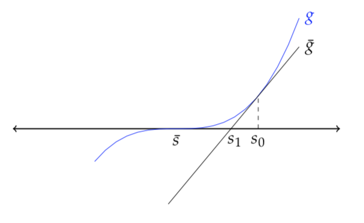

```{r setup, include=FALSE}
knitr::opts_chunk$set(echo = TRUE)
```

## Numerical optimisation

Unless your estimator has closed-form expression, optimisation will be usually required in your estimation. 

For most applications, derivative-based methods suffice. (Quasi)-Newton methods are especially simple. They are based on the Newton-Rhapson algorithm, which we discuss below.

Suppose you want to minimise a twice continuously differentiable function $\mathcal{L}: \Theta \to \mathbb{R}$, where $\Theta$ is an open set. Then we know the minimiser satisfies the FOC $\nabla_\theta \mathcal{L}(\theta^*) = 0$.

What is the idea behind the Newton-Rhapson procedure? Starting from a guess $\theta^{(n)}$, we linearise $\nabla_\theta \mathcal{L}(\theta)$ around $\theta^{(n)}$:

$$\nabla_\theta \mathcal{L}(\theta) \approx \nabla_\theta \mathcal{L}(\theta^{(n)}) + \nabla_{\theta \theta'} \mathcal{L}(\theta^{(n)}) (\theta - \theta^{(n)})$$

We then solve this linearised equation ($\nabla_\theta \mathcal{L}(\theta) = 0$), which gives us our next guess:

$$0 = \nabla_\theta \mathcal{L}(\theta^{(n)}) + \nabla_{\theta \theta'} \mathcal{L}(\theta^{(n)}) (\theta^{(n+1)} - \theta^{(n)}) \implies \theta^{(n+1)} = \theta^{(n)} - \nabla_{\theta \theta'} \mathcal{L}(\theta^{(n)})^{-1}\nabla_\theta \mathcal{L}(\theta^{(n)}) $$

Graphically:



So we have an iterative procedure to find the minimiser startng from an inital guess $\theta^{(0)}$, and stopping whenever $|\mathcal{L}(\theta^{(n+1)}) - \mathcal{L}(\theta^{(n)})|$ (or $\lVert \theta^{(n+1)} - \theta^{(n)}  \rVert$), falls below some threshold (absolute, relative).

The Newton-Rhapson algorithm is a root-finding algorithm. There are lots of Newton-based optimisation methods, all of which follow (in some way) the above principle. Common modifications of the above procedure include: multiply the jump $\nabla_{\theta \theta'} \mathcal{L}(\theta^{(n)})^{-1}\nabla_\theta \mathcal{L}(\theta^{(n)})$ by a scale parameter $r$; perform a line search between $\theta^{(n)}$ and $\theta^{(n+1)}$; replace $\nabla_{\theta \theta'}\mathcal{L}(\theta^{(n)})$ by $\nabla_{\theta}\mathcal{L}(\theta^{(n)}) \nabla_\theta \mathcal{L}(\theta^{(n)})'$ in order to speed things up (which is the basic point of the BHHH algorithm).

R's `optim` command includes the BFGS algorithm, a well-known quasi-Newton optimisation (_minimisation_ by default) method. All you need to pass is a starting guess (argument `par) and the objective (argument `fn`). The algorithm computes the gradient and the Hessian numerically. You may also pass the gradient if you have a closed-form expression for it. This can reduce the computational toll of "complex" problems considerably. There is also a limited-information BFGS method (L-BFGS-B). Whereas BFGS stores a dense ($\dim \theta \times \dim \theta$ matrix) approximation of the Hessian at each step (which can slow things up quite a lot in "large" problems), L-BFGS-B stores a few vectors that represent the approximation implicitly. L-BFGS-B also allows for box constraints (hence the last B). 

In more difficult problems, you may want to work with other methods. These will be useful when your function has multiple "complicated" local minima (e.g. BFGS with stochastic jumps); or when it is not differentiable (e.g. simplex methods like the Nelder-Mead algorithm in `optim`; or the LP algorithm for quantile regression in the `quantreg` package). 

## MLE

To illustrate these issues, let us work in a Poisson setting. Let the data be drawn from the following conditional model:

$$y|x \sim \text{Poisson}(\exp(x'\beta))$$
In this case, we have:

$$\ln f(y_i|x_i;b) = y_i x'b - \exp(x'b)  - y_i!$$
And, in the case of a random sample $\{y_i, x_i\}_{i=1}^n$, the log-likelihood is:

$$\mathcal{L}(\{y_i\}_{i=1}^n|\{x_i\}_{i=1}^n, b) = \sum_{i=1}^n \ln f(y_i|x_i;b)$$

Let us perform a small exercise where we generate a dataset from the above dgp. We'll have $x = (1, x_1)'$, where $x_1 \sim \text{Unif}[0,1]$. We'll set $\beta_0 = 0$ and $\beta_1 = 0.5$

```{r dgp_pois}
#This function generates a sample of size N from the DGP described earlier. beta is the parameter vector that generates the data.
dgp_pois <-function(Nsample, beta)
{
  x1 = runif(Nsample)
  X = cbind("intercept" = 1, "x1" = x1)
  y = rpois(N, exp(X%*%beta))
  return(cbind("y" = y,X))
}

#Choice of (true) parameters
beta = c(0,0.5)

#Sample size
N = 500

#Draws from the DGP
dataset = dgp_pois(N, beta)

hist(dataset[,1], freq = F, xlab = "y")

```

Given the `dataset`, let us estimate $\beta$ via MLE. The observation score is

$$s_i(b) := \nabla_{b} \ln f(y_i|x_i;b) = \left(y_i - \exp(x_i'b)\right)x_i$$

and the sample score is $\sum_{i=1}^n s_i(b)$.

```{r lkl}
#Computes individual log-likelihood
lkl.i <-function(b, y, X)
{
  return(dpois(y, exp(X%*%b), log = T))
}

#Sample likelihood
lkl.sample <-function(b, y, X)
{
  return(sum(lkl.i(b,y,X)))
}

#Computes individual score
score.i <-function(b,y,X)
{
  return(as.vector(y - exp(X%*%b))*X)
}

#Computes sample score
score.sample <-function(b,y,X)
{
  return(colSums(score.i(b,y,X)))
}
```

We are now ready to work with the optimisation problem.

```{r mle.bfgs}

#Optimisation w/o passing gradient. We need to set fnscale = -1 in control so we maximise
#instead of minimise (or just put a minus sign in the previous functions)
opt.1 = optim(fn =  lkl.sample, par = c(1,1), method = "BFGS", control = list("fnscale"=-1), y = dataset[,1], X = dataset[,2:3])

#Optimisation passing the gradient
opt.2 = optim(fn =  lkl.sample, par = c(1,1), gr = score.sample, method = "BFGS", control = list("fnscale"=-1), y = dataset[,1], X = dataset[,2:3])

#Let's see what happens
opt.1
opt.2
```

Recall that, since the information equality holds, a consistent estimator for the asymptotic variance is $-H(\hat{\beta}_{MLE})^{-1}$, where $H(b) = \sum_{i=1}^n \nabla_{bb'} \ln f(y_i|x_i,b)$. So we need the Hessian of the objective evaluated at the solution. We can ask `optim` to give us that through the option `hessian = T`:

```{r mle.avar}
model.mle = optim(fn =  lkl.sample, par = c(1,1), gr = score.sample, method = "BFGS", hessian=T, control = list("fnscale"=-1), y = dataset[,1], X = dataset[,2:3])

print(model.mle$hessian)

b.mle = model.mle$par
se.mle = sqrt(diag(-solve(model.mle$hessian)))


table.results = cbind("Beta" = b.mle, "SE" = se.mle, "Z-stat" = b.mle/se.mle)

print(table.results)
```


R is able to run a Poisson model under the generalised linear model `glm` convenience function. Let us compare our results

```{r poisson.glm}
glm.pois = glm(y~x1,family = "poisson", data= as.data.frame(dataset))

summary(glm.pois)
```

##QMLE

What if the distribution is not Poisson? In this case, we enter in what is known as *Quasi Maximum-Likelihood*.

From a more general perspective, let $Q_n(\theta) := n^{-1}\sum_{i=1}^n\ln f(w_i;\theta)$ be a (properly rescaled) MLE objective function. Let $Q_0(\theta):= \mathbb{E}[f(w;\theta)]$, where expectation is takeN with respect to the true distribution (which does not necessaraily admit a density in the family $\{f(\cdot;\theta): \theta \in \Theta\}$). Provided that $\theta_0 = \text{argmax}_{\theta \in \Theta} Q_0(b)$ is well-defined (exists and is unique), and that the usual regularity conditions hold, $\hat{\theta}_n \overset{p}{\to} \theta_0$ and $\sqrt{n}(\hat{\theta}_n - \theta_0)$ convergences in distribution to a Normal. This seems about right: you need not use that the density is correctly specified in showing consistency and asymptotic normality (provided that the regularity conditions hold). Where you _do_ require correct specification is in showing the information equality holds. So, in the context of QMLE (also known as pseudo-MLE), we must work with a sandwich estimator for the asymptotic variance.

In the context of QMLE, $\theta_0$ is known as a pseudo-true parameter. It provides the "best" approximation (in a Kullback-Leibler divergence sense) to the true density in the family of densities $\{f(\cdot;\theta): \theta \in \Theta\}$.

QMLE has a quite nice interpretation in the Poisson model. Note that the MLE estimator solves the sample analog of the moment condition:

$$\mathbb{E}[x_i(y_i - \exp(x_i'\beta))] = 0$$

Thus provided that $\mathbb{E}[y|x] = \exp(x'\beta)$ and that the conditional mean is identified (and the other technical conditions you already know), $\hat{\beta}_\text{MLE}$ consistently estimates the conditional mean, _even if the true distribution is not Poisson_.

To see this point more clearly, let us assume that $y|x \sim \text{Geom}(p_x)$, where $p_x = \frac{1}{1+\exp(x'\beta)}$. In this case $\mathbb{E}[y|x] = p_x/(1-p_x) = \exp(x'\beta)$. Suppose we do not know the distribution is geommetric, and decide to run a Poisson regression MLE. Let us conduct a small Monte Carlo exercise to show the estimator is consistent, and that valid inference can be done, provided we use sandwich estimators. To see this, let's draw 1,000 samples (500 obs each) from the DGP (again, $x_1 \sim \text{Unif} = 0$ and $\beta_0 = 0$, $\beta_1 = 0.5$). For each sample, we'll find the MLE estimator, and test the null $\beta_1 = 0.5$. We'll then calculate the mean and proportion of rejections of the test across iterations, and see what we get (what should we get?).

```{r qmle}
#DGP for our Monte-Carlo
dgp_geom <- function(Nsample, beta)
{
  x1 = runif(Nsample)
  X = cbind("intercept"= 1,"x1" = x1)
  px = 1/(1+exp(X%*%beta))
  y = rgeom(Nsample, px)
  return(cbind("y"=y, X))
}

#Choice of (true) parameters
beta = c(0,0.5)

#Sample size
N = 500

#Number of replications
Nreps = 1000

#Results matrix of the MC
results = c()

#Setting seed to allow for replication
set.seed(783221)

#Looping through iterations
for(rep in 1:Nreps)
{
  #Draws from dataset
  data.mc = dgp_geom(N, beta)
  
  #Runs MLE
  mle.mc = optim(fn =  lkl.sample, par = c(1,1), gr = score.sample, method = "BFGS", hessian=T, control = list("fnscale"=-1), y = data.mc[,1], X = data.mc[,2:3])
  
  #Wrong SEs
  inv.Hessian = -solve(mle.mc$hessian)
  se.wrong = sqrt(diag(inv.Hessian))
  
  #Correct SEs
  score.mat = score.i(mle.mc$par, data.mc[,1], data.mc[,2:3])
  #Sandwich estimator for Avar
  avar.correct = inv.Hessian%*%(t(score.mat)%*%score.mat)%*%inv.Hessian
  se.right = sqrt(diag(avar.correct))
  
  #Stores results and rejection rates of tests w/ wrong and right se.
  results = rbind(results, cbind(t(mle.mc$par),  abs((mle.mc$par[2]-beta[2])/se.wrong[2])>qnorm(0.975), abs((mle.mc$par[2]-beta[2])/se.right[2])>qnorm(0.975)))
  
}
#Giving names to the columns
colnames(results) = c(paste("Intercept =",beta[1]), paste("Beta1 =", beta[2]), "Rej.wrong.test", "Rej.right.test")

#Mean estimates and rejection rates
colMeans(results)
```


Note that using the "simplified" covariance matrix led to overrejection of the null, whereas the sandwich estimator yields the correct size.

##GMM

Let's do GMM now. Suppose we get a sample drawn from the previous Geommetric DGP, but we only know that $\mathbb{E}[y|x] = \exp(x'\beta)$. You decide to use $h(x) = \begin{bmatrix} 1 & x & x^2  \end{bmatrix}'$, $\mathbb{E}[(y - \exp(x'\beta))h(x)] = 0$ in estimation. Let's implement the optimal GMM estimator under this choice of moments.

```{r gmm}
#Draws from DGP
N = 1000
beta = c(0,0.5)
data.gmm = dgp_geom(N, beta)

hist(data.gmm[,1], freq = T, xlab = "y")

#Function that returns the moment function evaluated at an observation
moment.observation <-function(b, y, X)
{
  return(as.vector(y- exp(X%*%b))*cbind(X, X[,2]^2))
}

#GMM objective function, where W is a 3x3 weighing matrix passed by the user
gmm.objective <- function(b, y, X, W)
{
  gn = colMeans(moment.observation(b,y,X))
  return(t(gn)%*%W%*%gn)
}

#Jacobian of moment function
jacob.moment.observation <- function(b,y,X)
{
  return(t(cbind(X, X[,2]^2)*(-exp(X%*%b))) )
}


#Let's run a NLS of y on (1,x1) to get a starting point for the optimisation method.
#In practice, a good choice of starting point is really important for GMM to converge, as a highly nonlinear function may have multiple local minima
nls.cmean = nls(y~exp(beta0+beta1*x1), start =  list("beta0"=0, "beta1"=1),data = as.data.frame(data.gmm))

#First-step GMM
gmm.fs = optim(fn = gmm.objective, par = nls.cmean$m$getAllPars(), method = "BFGS",  y = data.gmm[,1],
               X = data.gmm[,2:3], W = diag(3))

gmm.fs

#Let's compute an estimator for the optimal weighing matrix
optimal.weight.hat = solve(t(moment.observation(gmm.fs$par, y = data.gmm[,1], X = data.gmm[,2:3]))%*%moment.observation(gmm.fs$par, y = data.gmm[,1], X = data.gmm[,2:3])/N)

#Second-step GMM using estimated optimal weight
gmm.second.stage = optim(fn = gmm.objective, par = gmm.fs$par, method = "BFGS",  y = data.gmm[,1],
               X = data.gmm[,2:3], W = optimal.weight.hat)

gmm.second.stage
```

Notice that I did not pass the gradient of the objective function to `optim` in the GMM estimation. In practice, you should always do it, for three reasons: 

1. it helps to speed up the optimisation in "large" and "complex" problems; 
2. it may acutally help in convergence to the right solution when small nummerical approximation errors in the gradient/Hessian may lead your algorithm astray;
3. you need the Jacobian of the moment conditions for inference anyway, and computing the gradient once you have the Jacobian is quite simple (right?).

##Quantile regression
Let's do a quantile regression from the first problem set now. For this we will use the `quantreg` package:

```{r quantile}
#Uncomment this line to install the quantreg package if you don't have it.
#install.packages(quantreg)

#Loads package
library(quantreg)

#Loading dataset from exercise
dados.consumidor = read.csv("consumer.csv")

#Running linear model for \tau \in \{0.25,0.5, 0.75\}
model.quant = rq(PX1~RATEX+UNEMP+AGE+SEX+FAMSIZE+INCOME, data = dados.consumidor, tau = c(0.25,0.5,0.75))

summary(model.quant, se = "nid")
```

What is option `nid` in argument `se`? Recall that the asymptotic variance of the linear quantile estimator is:

$$\text{Avar}(\sqrt{n}(\hat{\theta}_n - \theta_0)) = \tau (1-\tau) \mathbb{E}\left[f_{\epsilon|x}\left(0|x_i\right) x_i x_i'\right]^{-1} \mathbb{E}[x_i x_i'] \mathbb{E}\left[f_{\epsilon|x}\left(0|x_i\right) x_i x_i'\right]^{-1}$$
Basically, option `nid` does _not_ assume $x \perp \epsilon$ (in which case things get a lot easier). This means we need estimates of $f_{\epsilon|x}(0|x_i)$ for every $x_i$ in the sample.

How does `se = nid` do this? Well, first note that $f_{\epsilon|x}(0|x_i) = f_{y|x}(x_i'\beta(\tau)|x_i)$ (why?) and that:

$$\frac{d Q_{\tau}(y|x)}{d \tau} = \frac{d F^{-1}_{y|x}(\tau|x)}{d \tau} = \frac{1}{f_{y|x}(Q_{\tau}(y|x)|x)}$$

Thus, provided that conditional quantiles are linear in a neighborhoud of $\tau$, we have:

$$f_{y|x}(x_i'\beta_\tau|x_i) = \frac{1}{\frac{d \beta(\tau)'x_i}{d \tau}} \approx \frac{2h}{(\beta(\tau + h) - \beta(\tau -h))'x_i}$$
where $h$ is a small number. This suggests estimating a linear model for $\tau+h$ and $\tau -h$ and using the above formula in estimating the variance.

Finally, let's test hypotheses across quantiles.
```{r quantile.anova}
#Performing a Wald test of equality of slopes beta_0.25 = beta_0.5 = beta_0.75
anova(model.quant, test = "Wald", joint = F, se = "nid")
```


